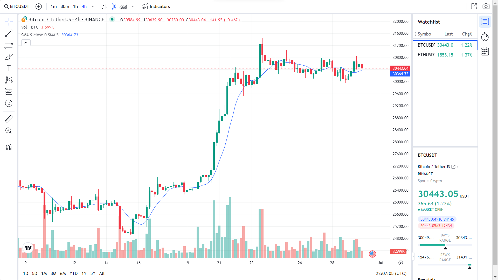
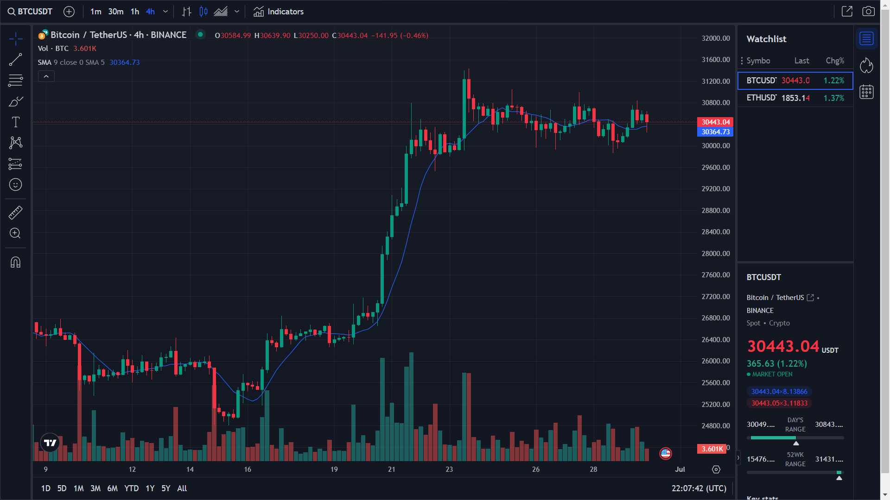

### Tradingview Widget

This project demonstrates how to integrate the **TradingView** widget into a webpage to display customizable financial charts. Using the TradingView API, this widget allows users to view real-time cryptocurrency data and interact with various chart features. This README provides an overview of the project files and explains how the TradingView API is used to create a dynamic financial chart.

## Project Structure

The project consists of the following files:

- **index.html**: The main HTML file that contains the TradingView widget setup. It loads the TradingView API and initializes the chart with customizable options.
- **style.css**: A CSS file for basic styling, which can be modified to customize the look and feel of the widget container.

## Overview of Each File

### 1. `index.html`

The `index.html` file contains the HTML structure for the webpage, which includes:

- **HTML Head**:

  - Links to the `style.css` file for basic styling.
  - A descriptive `<title>` tag.

- **Body**:
  - A `<div class="tradingview-widget-container">` that serves as the container for the TradingView widget.
  - The TradingView widget is initialized by loading `tv.js` (TradingView’s API script) via the following line:
    ```html
    <script
      type="text/javascript"
      src="https://s3.tradingview.com/tv.js"
    ></script>
    ```
  - A `<script>` block with configuration settings that define the widget’s appearance and behavior.

### 2. `style.css`

The `style.css` file allows you to style elements on the page. By default, the widget is styled through the TradingView API, but you can use this file to adjust the page layout and widget container styles.

## How the TradingView API Works

The TradingView API (tv.js) provides a streamlined way to embed financial charts onto a webpage. The API is loaded via a CDN link, making it easy to use without downloading or hosting the script.

Here’s a breakdown of how the API works in this project:

1. **Initialization**:  
   Once the API script (`tv.js`) is loaded, you can create a new widget instance using `new TradingView.widget(...)`.

2. **Configuration Options**:
   The widget is highly customizable through various configuration options. In this example, the widget is configured with:

   - `"symbol"`: Sets the default asset (e.g., Bitcoin to USD from Bitstamp).
   - `"interval"`: Defines the chart interval (e.g., daily).
   - `"autosize"`: Ensures the widget resizes to fit the container.
   - `"theme"` and `"toolbar_bg"`: Style the widget’s theme and toolbar background color.
   - `"watchlist"`: Provides a list of additional assets for tracking.
   - `"studies"`: Adds indicators (e.g., EMA) to the chart.

3. **Container and Popup**:
   - The widget displays within the container `<div id="tradingview_33f92">`.
   - Options like `"show_popup_button"` enable users to expand the widget in a popup view.

## Usage

To try out this project, simply clone the repository and open `index.html` in a browser. Ensure you have an active internet connection to load the TradingView API from its CDN.

1. Clone the repository:
   ```bash
   git clone https://github.com/its-me-mhd/TradingView-Widget.git
   ```

# View the project in here 👇

https://its-me-mhd.github.io/Trading-view/

# Screenshot 👇

Here we have project screenshot :



